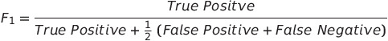

# Fake-Job-Posting-Prediction

## Project Overview

As online job portals and recruitment techniques have become more prevalent, the problem of fraudulent job postings has escalated. These deceptive postings not only squander the time of job seekers but also jeopardize their sensitive personal details, such as their address, bank account information, and social security numbers. Our project is geared towards examining job postings to discern genuine opportunities from fraudulent ones.

Data Source 

The dataset utilized in this project is sourced from Kaggle, available at https://www.kaggle.com/datasets/shivamb/real-or-fake-fake-jobposting-prediction/data. This dataset comprises 17,880 job postings, approximately 800 of which are identified as fake.

Project Objective

The primary goal of this project is to differentiate between authentic and fraudulent job postings. The dataset consists of both textual and numerical data, necessitating the use of two distinct models to handle each type of data. The final classification will be a combination of the outcomes from both models.

Project Workflow:

1. Problem Definition (Project Overview, Project statement and Metrics)
2. Data Collection 
3. Data cleaning, exploring and pre-processing
4. Modeling
5. Evaluating

## Metrics

The evaluation of the models will be based on two key metrics:

1. Accuracy: This metric is calculated using the formula:

As the formula suggests, this metric produces a ratio of all correctly categorized data points to all data points. This is particularly useful since we are trying to identify both real and fake jobs unlike a scenario where only one category is important. There is however one drawback to this metric. Machine learning algorithms tend to favor dominant classes. Since our classes are highly unbalanced a high accuracy would only be a representative of how well our model is categorizing the negative class (real jobs).

2. F1-Score: F1 score is a measure of a model’s accuracy on a dataset. The formula for this metric is – 

F1-score is used because in this scenario both false negatives and false positives are crucial. This model needs to identify both categories with the highest possible score since both have high costs associated to it. 

# Analysis

## Data Exploration

The dataset for this project can be accessed on Kaggle at https://www.kaggle.com/shivamb/real-or-fake-fake-jobposting-prediction. It comprises 17,880 entries across 18 features.

The dataset encompasses various data types including integers, booleans, and text. Below is a concise description of each variable:

|   #   |   Variable             |   Data Type  |   Description                                                                                                                                     |
|-------|------------------------|--------------|---------------------------------------------------------------------------------------------------------------------------------------------------|
|   1   |   job_id               |   integer    |   Unique identification number assigned to each job posting                                                                                       |
|   2   |   title                |   text       |   Descriptive name of the job position                                                                                                           |
|   3   |   location             |   text       |   Information regarding the job location                                                                                                          |
|   4   |   department           |   text       |   Department offering the job                                                                                                                      |
|   5   |   salary_range         |   text       |   Expected salary range                                                                                                                            |
|   6   |   company_profile      |   text       |   Description of the company                                                                                                                       |
|   7   |   description          |   text       |   Brief description of the job position                                                                                                            |
|   8   |   requirements         |   text       |   Qualifications required for the job                                                                                                              |
|   9   |   benefits             |   text       |   Benefits provided by the job                                                                                                                      |
|   10  |   telecommuting        |   boolean    |   Indicates if remote work is allowed                                                                                                              |
|   11  |   has_company_logo     |   boolean    |   Indicates if the job posting includes a company logo                                                                                              |
|   12  |   has_questions        |   boolean    |   Indicates if the job posting includes questions                                                                                                  |
|   13  |   employment_type      |   text       |   Categories include Full-time, Part-time, Contract, Temporary, and Other                                                                          |
|   14  |   required_experience  |   text       |   Levels of experience required such as Internship, Entry Level, Mid-senior level, Director, Executive, or Not Applicable                        |
|   15  |   required_education   |   text       |   Educational qualifications required such as Bachelor’s degree, High school degree, Associate degree, Master’s degree, etc.                    |
|   16  |   Industry             |   text       |   Industry relevant to the job posting                                                                                                              |
|   17  |   Function             |   text       |   General function of the job                                                                                                                       |
|   18  |   Fraudulent           |   boolean    |   Target variable indicating if the job posting is fake (1) or real (0)                                                                            |

Given that most data types are either booleans or text, a summary statistic is unnecessary. The only integer variable, job_id, is irrelevant for this analysis. Further exploration of the dataset is conducted to identify any null values.

Variables like department and salary_range, which contain numerous missing values, are excluded from subsequent analysis.

Upon initial evaluation of the dataset, it became apparent that the job postings originated from various countries, resulting in postings in different languages. To streamline the process, this project focuses solely on data from locations within the United States, which constitute nearly 60% of the dataset. This decision ensures that all data is in English for ease of interpretation. Additionally, the location variable is divided into state and city for further analysis. The resulting dataset comprises 10,593 entries and 20 features.

The dataset exhibits a significant class imbalance, with 9,868 (approximately 93.2%) of the jobs categorized as real and only 725 (6.8 %) classified as fraudulent. This imbalance is clearly depicted in a countplot.

## Exploratory Analysis

The initial step in visualizing the dataset for this project involves generating a correlation matrix to explore the relationships within the numeric data.

**Figure 4. Correlation Matrix**

The correlation matrix reveals no significant positive or negative correlations among the numeric variables. 

However, an intriguing trend emerged concerning the boolean variable "telecommuting." When this variable is zero, there is a noteworthy 92% probability that the job posting is fraudulent.

Following the analysis of numeric features, attention is directed towards exploring the textual features within the dataset. We commence this exploration with the "location" variable.

The graph above illustrates the states that generate the highest number of job postings, with California, New York, and Texas leading the pack. To delve deeper into this observation, another bar plot is generated, depicting the distribution of fake and real jobs within the top 10 states.

The graph above indicates that Texas and California exhibit a higher likelihood of containing fake jobs compared to other states. To further delve into this analysis and incorporate both states and cities, a ratio is computed. This ratio represents the number of fake jobs available for every real job, calculated using the following formula:

Below, only ratio values greater than or equal to one are plotted.

Further analysis reveals that Bakersfield in California boasts a fake to real job ratio of 15:1, while Dallas, Texas exhibits a ratio of 12:1. Job postings originating from these locations are highly likely to be fraudulent. 

Additional exploration of text-based variables is conducted to uncover any significant relationships.

The graphs above reveal that the majority of fraudulent jobs fall under the full-time category, often targeting entry-level positions that require either a bachelor’s degree or a high school education.

To further enhance the analysis of text-related fields, these categories are consolidated into a single field labeled "summary." The fields combined include: title, location, company_profile, description, requirements, benefits, required_experience, required_education, industry, and function. Subsequently, a KDE plot depicting character count is examined to illustrate the distinction between real and fake jobs. Despite a relatively similar character count distribution for both real and fake jobs, real jobs exhibit a higher frequency.

## Algorithms and Techniques

Based on the initial analysis, it's clear that both text and numeric data will be utilized for the final modeling. Before proceeding to data modeling, a final dataset is determined, incorporating the following features:

1. telecommuting
2. fraudulent
3. ratio: fake to real job ratio based on location
4. summary: combination of title, location, company_profile, description, requirements, benefits, required_experience, required_education, industry, and function
5. character_count: Count of words in the textual data

Further pre-processing is necessary before the textual data can be utilized for any data modeling.

The algorithms and techniques employed in this project include:

1. Natural Language Processing
2. Naïve Bayes Algorithm
3. SGD Classifier

Naïve Bayes and SGD Classifier are compared in terms of accuracy and F1-scores, and a final model is chosen. Naïve Bayes serves as the baseline model due to its ability to compute conditional probabilities of occurrence of events based on individual event probabilities, which is beneficial in encoding such probabilities. The comparative model, SGD Classifier, is chosen for its implementation of a plain stochastic gradient descent learning routine, which supports various loss functions and penalties for classification. High penalties will be applied when misclassification occurs. These models are applied separately to both the text and numeric data, and the final results are combined.

## Benchmark

The benchmark model for this project is Naïve Bayes. It achieves an overall accuracy of 0.964 and an F1-score of 0.705. The rationale behind selecting this model has been explained above. Any other model's performance will be compared to the results of Naïve Bayes.

# Methodology

## Data Preprocessing

The text processing steps are as follows:

- Tokenization: The textual data is segmented into smaller units, typically words.
- To Lower: All words are converted to lowercase to ensure uniformity.
- Stopword Removal: Words that do not contribute significant meaning to sentences, such as "the," "a," "an," "he," and "have," are eliminated.
- Lemmatization: This process involves grouping together inflected forms of words to analyze them as a single item.

## Implementation

A diagrammatic representation of the implementation of this project is provided below:

1. Dataset Splitting: The dataset is divided into three subsets - text, numeric, and y-variable.

2. Text Data Processing: The text dataset undergoes preprocessing steps, including tokenization, lowercase conversion, stopword removal, and lemmatization. This processed text data is then converted into a term-frequency matrix for further analysis.

3. Train-Test Split: Utilizing scikit-learn, the datasets are split into training and testing datasets. The training set comprises 70% of the original dataset.

4. Model Training: The baseline model, Naïve Bayes, and another model, SGD, are trained on the training dataset.

5. Model Evaluation: The trained models are applied to the test dataset to assess their performance. The outcomes of the models based on the two test sets (numeric and text) are combined. A job posting is classified as fraudulent only if both models concur that it is not fraudulent. This approach mitigates the bias of Machine Learning algorithms towards majority classes.

6. Performance Comparison: The Accuracy and F1-score of the two models, Naïve Bayes and SGD, are compared. The model with superior performance is selected as the final model for analysis.

# Results

## Model Evaluation and Validation

The final model used for this analysis is – SGD. This is based on the results of the metrics as compared to the baseline model. The outcome of the baseline model and SGD are presented in the table below:

|     Model                             |     Accuracy    |     F1-score    |
|---------------------------------------|-----------------|-----------------|
|     Naïve Bayes (baseline   model)    |     0.964       |     0.705       |
|     SGD                               |     0.973       |     0.809        |

Based on these metrics, SGD has a slightly better performance than the baseline model. This is how the final model is chosen to be SGD. 

## Justification

As mentioned above, the final model performs better than the established benchmark of the baseline model. The model will be able to identify real jobs with a very high accuracy. However, it’s identification of fake jobs can still be improved upon.

## Free-Form Visualization

A confusion matrix can be used to evaluate the quality of the project. The project aims to identify real and fake jobs.

The confusion matrix above displays the following values – categorized label, number of data points categorized under the label and percentage of data represented in each category. The test set has a total of 3265 real jobs and 231 fake jobs. Based on the confusion matrix it is evident that the model identifies real jobs 98.07% of the times. However, fraudulent jobs are identified only 86.58% of the times. Only 2% of the times has the model not identified the class correctly. This shortcoming has been discussed earlier as well as Machine Learning algorithms tend to prefer the dominant classes. 

## Reflection

Fake job postings are an important real-world challenge that require active solutions. This project aims to provide a potential solution to this problem. The textual data is pre-processed to generate optimal results and relevant numerical fields are chose as well. The output of Multiple models is combined to produce the best possible results. This is done to reduce the bias that a machine learning model has towards the dominant class.

The most interesting part of this project was how certain locations are an epitome of fraudulent jobs. For example, Bakersfield, California has a fake to real job ratio of 15:1. Places like this require some extra monitoring. Another interesting part was that most entry level jobs seem to be fraudulent. It seems like scammers tend to target younger people who have a bachelor’s degree or high school diploma looking for full-time jobs.
The most challenging part was text data preprocessing. The data was in a very format. Cleaning it required a lot of effort. 

## Improvement

The dataset that is used in this project is very unbalanced. Most jobs are real, and few are fraudulent. Due to this, real jobs are being identified quite well. Certain techniques like SMOTE can be used to generate synthetic minority class samples. A balanced dataset should be able to generate better results. 

